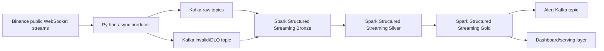

# Real-Time Crypto Market Intelligence Pipeline

Portfolio-grade streaming data engineering project for ingesting public crypto market data, processing it with Kafka and Spark Structured Streaming, storing Bronze/Silver/Gold Delta Lake datasets, and serving real-time market intelligence signals.

This project is not a trading bot, does not execute trades, and does not provide financial advice. It uses only Binance public market WebSocket streams with no API key and no account-specific data.

## Project Goal

Crypto markets generate continuous, high-frequency trade and price events across many assets. Raw WebSocket payloads are semi-structured and not immediately suitable for analytics, monitoring, or dashboarding. This project builds a production-style streaming pipeline that validates, routes, stores, deduplicates, aggregates, and serves those events as market intelligence outputs.

## Core Components

- Local Kafka broker using Docker Compose
- Kafka UI for topic inspection
- Project folder scaffold
- Topic configuration and creation script
- Storage folders for Bronze, Silver, Gold, and checkpoints
- JSON Schema contracts for raw market events, invalid events, and alerts
- Kafka topic design documentation
- Async Binance WebSocket producer for trade, kline, and ticker streams
- Producer-side validation and invalid-event publishing to `market.events.invalid`
- Bronze Structured Streaming jobs that preserve Kafka metadata in Delta Lake
- Silver Structured Streaming jobs that normalize and deduplicate market events
- Gold Structured Streaming jobs that compute OHLC, volatility, volume spikes, price movement alerts, and watchlist summaries
- Alert publishers that convert Gold signals into Kafka alert events

## Architecture



## Local Services

| Service | Purpose | Local URL |
| --- | --- | --- |
| Kafka | Local broker for raw, DLQ, and alert topics | `localhost:9092` |
| Kafka UI | Inspect topics, partitions, messages, and consumer groups | `http://localhost:8080` |

## Kafka Topics

| Topic | Purpose | Partitions | Key | Schema |
| --- | --- | ---: | --- | --- |
| `market.trades.raw` | Raw trade events from Binance WebSocket | 6 | `symbol` | `schemas/trade_event_v1.json` |
| `market.klines.raw` | Raw 1-minute candlestick events | 3 | `symbol` | `schemas/kline_event_v1.json` |
| `market.tickers.raw` | Raw 24-hour ticker events | 3 | `symbol` | `schemas/ticker_event_v1.json` |
| `market.events.invalid` | Dead-letter queue for invalid or malformed events | 3 | `source_topic` or `error_type` | `schemas/invalid_event_v1.json` |
| `market.signals.alerts` | Gold-level market intelligence alerts | 3 | `symbol` | `schemas/alert_event_v1.json` |

## Quick Start

Prerequisites:

- Docker Desktop or compatible Docker runtime
- Docker Compose v2
- Python 3.11+
- Bash

Run the local stack:

```bash
cp .env.example .env
docker compose up -d
bash kafka/create_topics.sh
docker compose ps
```

Open Kafka UI:

```text
http://localhost:8080
```

List topics:

```bash
docker compose exec -T kafka /opt/kafka/bin/kafka-topics.sh --bootstrap-server kafka:9092 --list
```

The same workflow is available through `make`:

```bash
make up
make topics
make topics-list
```

Kafka broker data is stored in a named Docker volume, so ordinary `docker compose down` and `docker compose up -d` cycles keep topics, committed offsets, and retained messages. Removing volumes with `docker compose down -v` intentionally resets Kafka state.

Install and run the producer:

```bash
make setup-venv
source .venv/bin/activate
python -m producers.binance_ws_producer
```

Or run through Make with the virtualenv interpreter:

```bash
make producer PYTHON=.venv/bin/python
```

Run a Bronze stream:

```bash
make bronze-all PYTHON=.venv/bin/python
```

Bronze Delta outputs are written under `./storage/bronze`. Checkpoints are written under `./storage/checkpoints/bronze`.
Local Spark jobs use the virtualenv PySpark runtime by default so an unrelated machine-level `SPARK_HOME` does not leak into the project.
The grouped Bronze runner starts trades, klines, tickers, and invalid-events queries inside one Spark application. Its Spark UI defaults to `http://localhost:4040`.

Run a Silver stream after the matching Bronze stream has created data:

```bash
make silver-all PYTHON=.venv/bin/python
```

Silver Delta outputs are written under `./storage/silver`. Checkpoints are written under `./storage/checkpoints/silver`.
The grouped Silver runner starts trades, klines, and tickers queries inside one Spark application. Its Spark UI defaults to `http://localhost:4050`.

Run Gold analytics after `silver_market_trades` has data:

```bash
make gold-all PYTHON=.venv/bin/python
```

Gold Delta outputs are written under `./storage/gold`. Checkpoints are written under `./storage/checkpoints/gold`.
The grouped Gold runner starts OHLC, trade summary, volatility, volume spike, price movement alert, and watchlist summary queries inside one Spark application. Its Spark UI defaults to `http://localhost:4060`.

Publish Gold alerts back to Kafka:

```bash
make alerts-volume PYTHON=.venv/bin/python
make alerts-price PYTHON=.venv/bin/python
```

Alert publisher checkpoints are written under `./storage/checkpoints/alerts`. Alert events are published to `market.signals.alerts` and can be inspected in Kafka UI or from the terminal:

```bash
make alerts-consume
```

Inspect Delta tables in JupyterLab:

```bash
.venv/bin/python -m ipykernel install --user --name crypto-market-intelligence --display-name "Crypto Market Intelligence (.venv)"
.venv/bin/jupyter lab
```

Open `notebooks/inspect_delta_tables.ipynb` and select the `Crypto Market Intelligence (.venv)` kernel.

## Repository Layout

```text
.
├── docker-compose.yml
├── Makefile
├── README.md
├── kafka/
│   ├── create_topics.sh
│   ├── kafka_design.md
│   └── topic_config.yaml
├── producers/
│   ├── binance_ws_producer.py
│   ├── config.py
│   ├── event_router.py
│   ├── kafka_producer.py
│   └── README.md
├── schemas/
│   ├── alert_event_v1.json
│   ├── invalid_event_v1.json
│   ├── kline_event_v1.json
│   ├── ticker_event_v1.json
│   └── trade_event_v1.json
├── streaming/
│   ├── bronze/
│   │   ├── bronze_all.py
│   │   └── common.py
│   ├── silver/
│   │   ├── common.py
│   │   ├── schemas.py
│   │   ├── silver_all.py
│   │   └── transformations.py
│   ├── gold/
│   │   ├── common.py
│   │   ├── gold_all.py
│   │   ├── gold_ohlc_1min.py
│   │   ├── gold_price_alerts.py
│   │   ├── gold_trade_summary_5min.py
│   │   ├── gold_volatility_5min.py
│   │   ├── gold_volume_spikes.py
│   │   └── gold_watchlist_summary.py
│   └── alerts/
│       ├── common.py
│       ├── publish_price_alerts.py
│       └── publish_volume_alerts.py
├── sinks/
│   └── alert_kafka_writer.py
├── dashboards/
├── notebooks/
│   └── inspect_delta_tables.ipynb
├── tests/
├── storage/
│   ├── bronze/
│   ├── silver/
│   ├── gold/
│   ├── checkpoints/
│   └── spark/
└── docs/
    ├── architecture.md
    ├── data_quality.md
    ├── kafka_design.md
    └── schema_contracts.md
```

## Design Docs

- [Architecture](docs/architecture.md)
- [Data quality](docs/data_quality.md)
- [Kafka design](docs/kafka_design.md)
- [Schema contracts](docs/schema_contracts.md)

## Engineering Focus

This project is designed to demonstrate senior-level streaming data engineering:

- Kafka topic design and partitioning
- Producer reliability and reconnect handling
- Schema contracts and data validation
- Dead-letter queue handling
- Spark Structured Streaming with event-time semantics
- Watermarking, checkpointing, and recovery
- Delta Lake medallion architecture
- Stateful aggregations and alerting
- Operational dashboarding and documentation

## Future Enhancements

Optional enhancements include order book depth streams, schema registry, Prometheus/Grafana, Databricks deployment, AWS MSK, S3-backed Delta storage, ML-based anomaly detection, and CI/CD.
