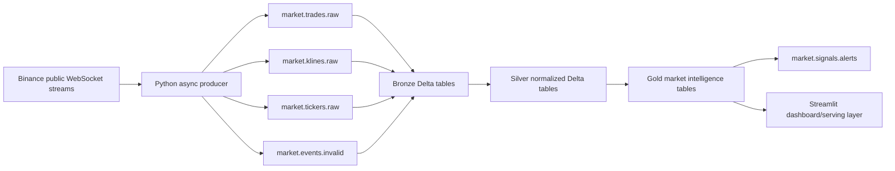

# Architecture

## Purpose

The Real-Time Crypto Market Intelligence Pipeline is a streaming data engineering project focused on Kafka, Spark Structured Streaming, Delta Lake, event-time processing, checkpointing, dead-letter handling, and operational serving.

It ingests only Binance public market WebSocket data. It does not use paid APIs, API keys, private account streams, order execution APIs, or trading logic.

## High-Level Flow



## Milestone 1 Scope

Milestone 1 creates the local foundation:

- Docker Compose for Kafka and Kafka UI
- Config-driven Kafka topic definitions
- Topic creation script
- Base repository structure for producers, schemas, streaming jobs, sinks, dashboard, tests, storage, and docs
- Local storage folders for Bronze, Silver, Gold, and checkpoints

## Local Infrastructure

| Component | Role | Local Address |
| --- | --- | --- |
| Kafka | Event log for raw market events, invalid events, and alerts | `localhost:9092` from host, `kafka:9092` inside Docker |
| Kafka UI | Browser UI for inspecting topics, partitions, messages, and consumer groups | `http://localhost:8080` |
| Local storage | Delta Lake paths and checkpoints for later Spark milestones | `./storage` |

The local Kafka broker runs in KRaft mode as a single-node development cluster. Topic replication factor is set to `1` because this is a local portfolio environment. The topic and code design keep the broker address and storage paths configurable so the project can later move to Databricks, MSK, or another managed Kafka runtime.

## Topic Strategy

Market event topics use the crypto symbol as the Kafka message key. This preserves ordering per symbol while allowing parallel processing across partitions.

| Topic | Purpose | Partitions | Retention |
| --- | --- | ---: | --- |
| `market.trades.raw` | Raw trade events | 6 | 72 hours |
| `market.klines.raw` | Raw 1-minute kline events | 3 | 7 days |
| `market.tickers.raw` | Raw 24-hour ticker events | 3 | 3 days |
| `market.events.invalid` | Dead-letter queue | 3 | 14 days |
| `market.signals.alerts` | Published market alerts | 3 | 7 days |

## Medallion Plan

Bronze will preserve Kafka metadata and raw payload strings for replay and auditability.

Silver will parse raw JSON into typed, normalized records, apply business validation, and deduplicate records using stable event identifiers.

Gold will compute market intelligence outputs such as 1-minute OHLC, 5-minute trade summaries, volatility signals, volume spike signals, price movement alerts, and watchlist summaries.

## Operational Design

The project is designed around production-style streaming concerns:

- Producer reconnect handling and structured logs
- Kafka headers for event metadata
- Validation before publish where feasible
- Dead-letter queue for malformed or invalid events
- Spark checkpoint paths per stream
- Event-time windows and watermarking for stateful aggregations
- Queryable Delta outputs for dashboard and serving

## Run Sequence

Milestone 1 local infrastructure run sequence:

```bash
cp .env.example .env
docker compose up -d
bash kafka/create_topics.sh
docker compose ps
```

After the stack is running, Kafka UI is available at `http://localhost:8080`.
