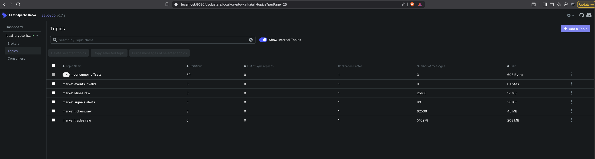
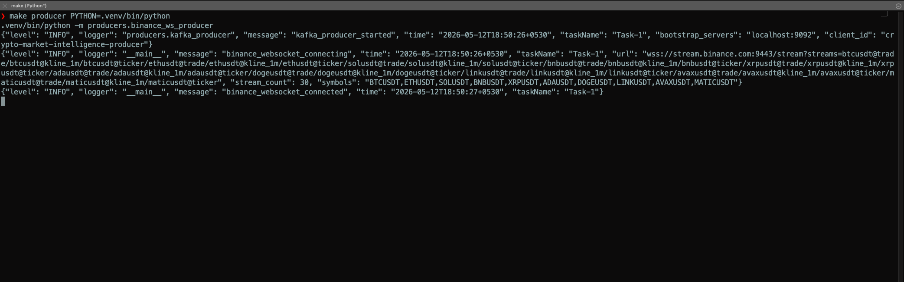
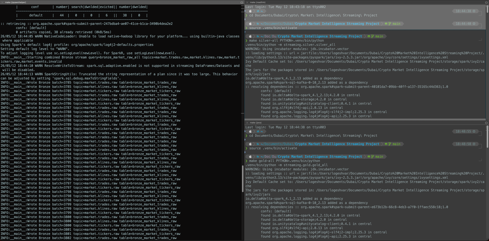
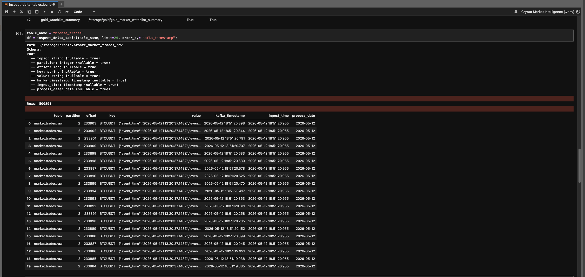
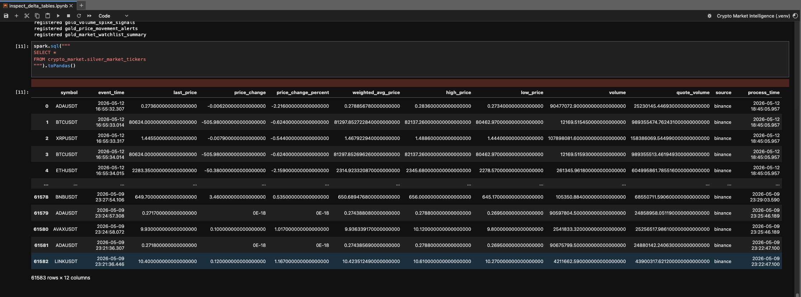
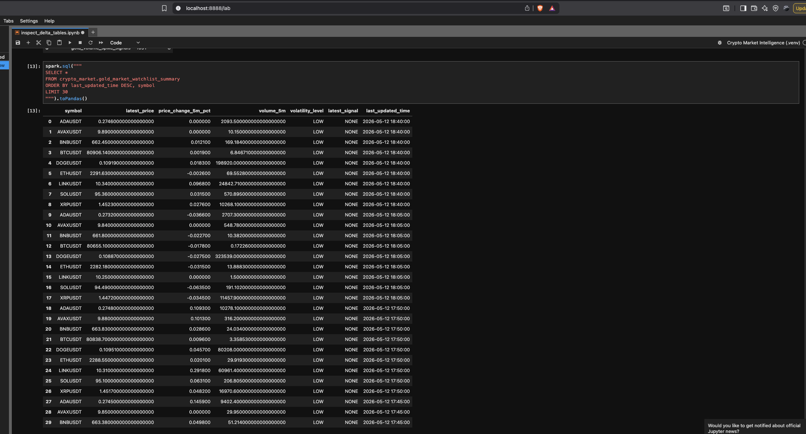
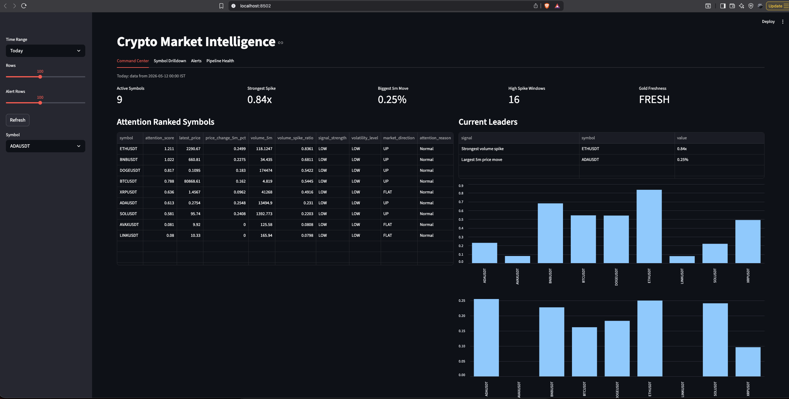
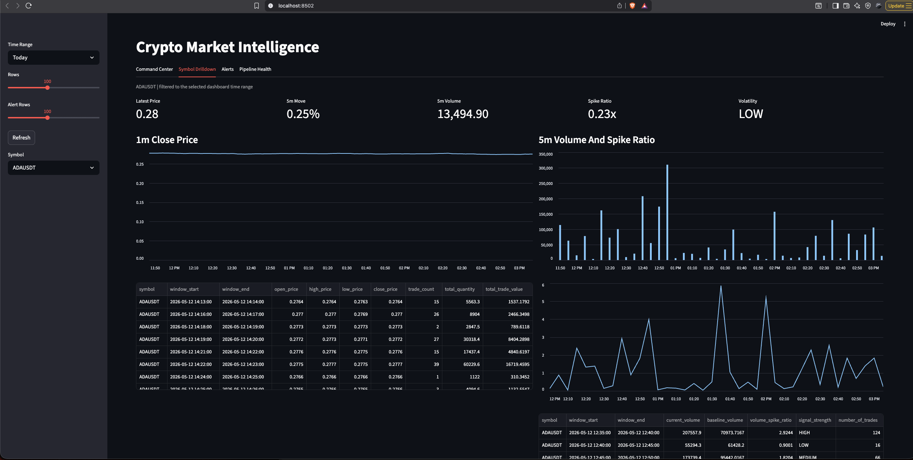
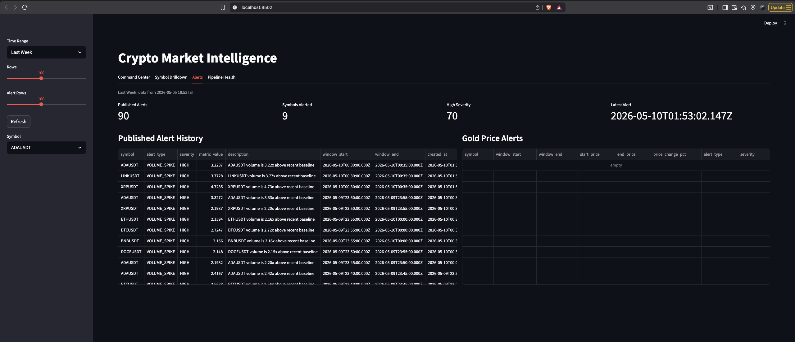
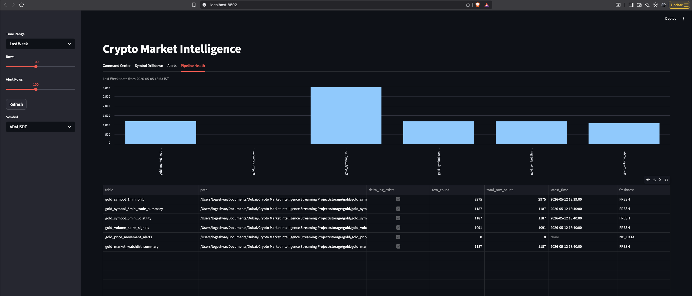

# Demo Evidence

## Purpose

This page captures visual evidence that the Real-Time Crypto Market Intelligence Pipeline runs locally from ingestion through serving. Screenshots are stored in `docs/assets/` and show the local Kafka topics, producer, streaming jobs, Delta tables, and dashboard views.

## Run Commands

Start the local infrastructure:

```bash
make up
make topics
```

Start the live producer:

```bash
make producer PYTHON=.venv/bin/python
```

Start the streaming layers in separate terminals:

```bash
make bronze-all PYTHON=.venv/bin/python
make silver-all PYTHON=.venv/bin/python
make gold-all PYTHON=.venv/bin/python
```

Start alert publishers in separate terminals:

```bash
make alerts-volume PYTHON=.venv/bin/python
make alerts-price PYTHON=.venv/bin/python
```

Start the dashboard:

```bash
make dashboard PYTHON=.venv/bin/python
```

## Screenshots

### Kafka Topics



The Kafka UI shows the local `local-crypto-kafka` cluster with the project topics created and actively receiving data. The raw topics are separated by event type:

- `market.trades.raw` has 6 partitions and the highest message volume.
- `market.klines.raw` and `market.tickers.raw` have 3 partitions each.
- `market.events.invalid` is present for dead-letter handling.
- `market.signals.alerts` is present and contains published alert events.

### Producer Running



The producer screenshot shows `make producer PYTHON=.venv/bin/python` running the Binance WebSocket producer from the project virtual environment. The logs show:

- Kafka producer startup against `localhost:9092`.
- Connection to the Binance public combined stream URL.
- `stream_count` of 30, covering trade, kline, and ticker streams for the configured symbols.
- Successful WebSocket connection after startup.

### Streaming Jobs



The terminal layout shows the streaming layers running as local Spark applications:

- Bronze is continuously writing raw market batches into Bronze Delta tables.
- Silver is started separately through `make silver-all`.
- Gold is started separately through `make gold-all`.

The Bronze logs show repeated batch writes for trades, klines, and tickers, which confirms that the combined Bronze stream is consuming Kafka and persisting data.

### Bronze Delta Table



The notebook preview shows `bronze_market_trades_raw` under `storage/bronze`. The table contains more than 500k rows in this run and preserves the raw ingestion contract:

- Kafka topic, partition, offset, message routing value, and Kafka timestamp.
- Raw JSON payload stored as `value`.
- Local ingestion time and process date.

This proves the Bronze layer keeps replay and audit data instead of immediately discarding source metadata.

### Silver Delta Table



The Silver notebook preview shows `silver_market_tickers` registered as a queryable table. It contains normalized ticker records with typed columns such as:

- `symbol`
- `event_time`
- `last_price`
- `price_change`
- `price_change_percent`
- `weighted_avg_price`
- `high_price`
- `low_price`
- `volume`
- `quote_volume`
- `source`
- `process_time`

The screenshot also shows data across multiple symbols and dates, which demonstrates that raw exchange payloads have been converted into analytics-ready records.

### Gold Delta Table



The Gold notebook preview shows `gold_market_watchlist_summary`, the serving-friendly summary table used by the dashboard. Rows include:

- latest symbol price
- 5-minute price movement percentage
- 5-minute volume
- volatility level
- latest signal
- last updated time

The screenshot shows multiple symbols updating across 5-minute windows. `latest_signal` is `NONE` for the visible rows, which is valid for normal market periods where no stronger signal is active for that symbol/window.

### Dashboard Command Center



The Command Center screenshot shows the main dashboard view filtered to `Today`. It summarizes current market state with:

- 9 active symbols.
- strongest volume spike ratio of `0.84x`.
- biggest 5-minute move of `0.25%`.
- 16 high spike windows.
- Gold freshness marked as `FRESH`.

The attention-ranked table surfaces the symbols most worth inspecting, while the leader panel and bar charts show the strongest current volume and price movement signals.

### Dashboard Symbol Drilldown



The Symbol Drilldown screenshot focuses on `ADAUSDT`. It shows:

- latest price around `0.28`.
- 5-minute move of `0.25%`.
- 5-minute volume of `13,494.90`.
- spike ratio of `0.23x`.
- volatility level `LOW`.

The lower panels show 1-minute close price history, 5-minute volume bars, spike-ratio movement, and the underlying Gold rows used for the visualizations.

### Dashboard Alerts



The Alerts screenshot shows the dashboard filtered to `Last Week`. It includes:

- 90 published alerts.
- 9 symbols alerted.
- 70 high-severity alerts.
- published alert records for `VOLUME_SPIKE` events.

The `Gold Price Alerts` table is empty in this run. That is acceptable because price surge/drop alerts are threshold-based and only appear when the configured 5-minute movement threshold is crossed. The alerting system is still demonstrated by the volume spike alerts shown in the published alert history.

### Dashboard Pipeline Health



The Pipeline Health screenshot shows Gold table freshness and row counts for the selected time range. The visible rows show:

- Delta logs exist for all Gold tables.
- OHLC, trade summary, volatility, volume spike, and watchlist tables contain rows.
- Latest update times are marked `FRESH` for active Gold outputs.
- `gold_price_movement_alerts` has zero rows and `NO_DATA`, which matches the empty price-alert evidence from the Alerts tab.
